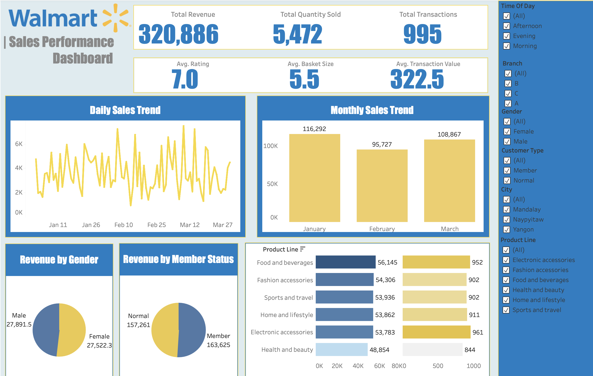

## Walmart Sales Performance Analysis

This project analyses Walmart retail sales data using SQL and Tableau to uncover sales trends, product performance and customer insights. The focus is on transforming raw transactional data into business-ready KPIs and visual dashboards for decision-making.

---

## 📂 Dataset
This dataset contains sales transactions from a three different branches of Walmart, respectively located in Mandalay, Yangon and Naypyitaw. The data contains 17 columns and 1000 rows:

| Column Name              | Description                                   | Data Type        |
|:--------------------------|:-----------------------------------------------|:------------------|
| invoice_id               | Invoice ID of the sales transaction           | VARCHAR(30)      |
| branch                   | Branch where the sale occurred                | VARCHAR(5)       |
| city                     | City of the branch                            | VARCHAR(30)      |
| customer_type            | Type of customer (Member / Normal)            | VARCHAR(30)      |
| gender                   | Gender of the customer                        | VARCHAR(10)      |
| product_line             | Product line of the item sold                 | VARCHAR(100)     |
| unit_price               | Price per unit of the product                 | DECIMAL(10, 2)   |
| quantity                 | Number of units sold                          | INT              |
| VAT                      | Value-added tax amount                        | FLOAT(6, 4)      |
| total                    | Total transaction value (incl. tax)           | DECIMAL(12, 4)   |
| date                     | Date of purchase                              | DATE             |
| time                     | Time of purchase                              | TIME             |
| payment_method           | Payment method used                           | VARCHAR(15)      |
| cogs                     | Cost of goods sold                            | DECIMAL(10, 2)   |
| gross_margin_perct       | Gross margin percentage                       | FLOAT(11, 9)     |
| gross_income             | Gross income from the transaction             | DECIMAL(12, 4)   |
| rating                   | Customer rating                               | FLOAT(2, 1)      |

---

## 🛠 Tools
- **SQL (MySQL)** – data wrangling, feature engineering and exploratory analysis  
- **Tableau** – interactive dashboard and data visualisation  

---

## SQL
🔎 **Full data exploration in MySQL here:** [SQL Queries]()
### Data Preparation & Feature Engineering (SQL)
Key transformations performed in MySQL:
- Remove missing values from database when creating the table by specifying **NOT NULL** for all columns
- Created derived time-based features:
  - `time_of_day` (Morning / Afternoon / Evening)
  - `day_name`
  - `month_name`

### Exploratory Data Analysis (EDA) in SQL
SQL-based EDA was conducted to understand patterns and guide dashboard design, including:
- Sales KPIs (revenue, transactions, basket size)
- Daily and monthly sales trends
- Product line performance
- Branch and city-level comparisons
- Customer segmentation (gender, membership type)
- Profitability and customer ratings

Not all exploratory queries are visualised in the final dashboard, some were used to validate assumptions and identify key metrics to surface.

## Tableau
🔎 **Check out the dashboard in Tableau Public here:** [Walmart Sales Performance Dashboard](https://public.tableau.com/app/profile/jenny.hoang5680/viz/WalmartSalesPerformanceDashboard_17655349317990/Dashboard1)
### Dashboard in Tableau
An interactive Tableau dashboard was created to present:
- Overall sales KPIs
- Daily and monthly sales trends
- Revenue breakdown by product line
- Customer segmentation insights
- Branch and city performance

The dashboard is designed for non-technical stakeholders, enabling quick exploration through filters. 

---

## 🎯 Insights and Business Recommendation
- **Sales dropped 17.7% in February from January before recovering.**  
  💡 Investigate the February drop (Was it a seasonality issue like holiday or inventory issue). Use this cyclical data to schedule a large-scale promotional event (e.g., a "February Savings" or “Valentine’s Promotion” for underperforming product lines like “Health and Beauty” and “Home and Lifestyle”) next year to stabilize the trend.
- **Naypyitaw has the highest total sales of $110,491 and the highest customer satisfaction of 7.1.**  
  💡 Deep-dive into Naypyitaw's inventory and promotional strategy for top-selling products (Food & Beverages) and implement those strategies in Mandalay and Yangon to boost their performance.
- **Member customers drive higher total sales of $163,625 (compared to non-member $157,261) and have a higher AOV $327.90 (as opposed to $317.10 from non-member). However, difference is not vastly different.**  
  💡 Dedicate a portion of the marketing budget to Member-exclusive promotions and rewards to increase the AOV further and convert more non-member customers to "Member" status.
